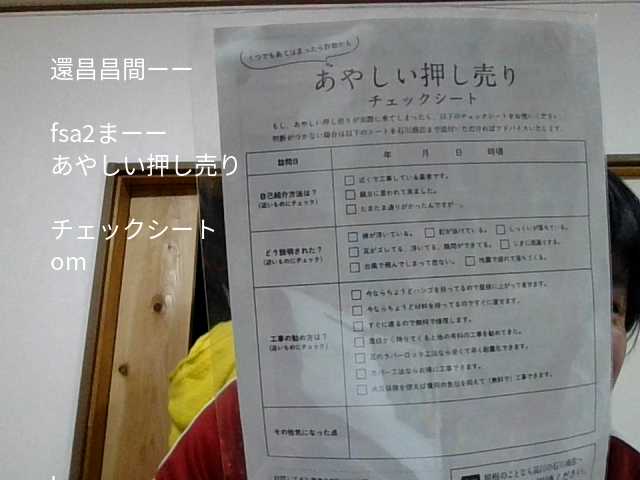

# Real time OCR (Character recognition)

- Read characters via webcam
- Case study of object detection

-------------------------------------
## Terminal message display ver

```
python magictime_ocr.py 

```
```
上した生有の和の
 はの上中
ーー馬ねだやかにする


 区した春のの
We PS 前 
 

本 8
"の中中 AM 立
-E8AWみES
```
## on the realtime display ver

```
python J_ocr.py

```
### example



-------------------------------

# Requirement
```
pip install opencv-python
pip install pytesseract
pip install Pillow
pip install numpy


```
## additional modules

```
sudo apt update
sudo apt install tesseract-ocr
sudo apt install libtesseract-dev


```

## Japanese 

```
sudo apt install tesseract-ocr-jpn

```

